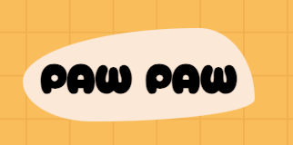

# Paw Paw <span> | </span>  <a href="https://lupemorales.github.io/anime/" target="_blank">   Demo </a><span> | </span>
    
Ayuda al cachorrito a encontrar su hueso favorito.

Paw Paw es un juego en 2d que consiste en guiar a un cachorrito a través del teclado o mediante los botones de la interfaz hasta su hueso. ¡Cuidado! no te choques con los arbustos o perderás vida.

### Web responsive mobile:


### Web responsive desktop:


## Instalación:

Para abrir el proyecto desde tu ordenador no olvides seguir estos pasos:

```
$ git clone https://github.com/lupeMorales/paw-paw
$ cd ../path/to/the/file
$npm install
$npm start
```

## Recursos
<p>
 <a href="https://9elements.github.io/fancy-border-radius/#57.34.68.23--100.250" target="_blank">Fancy Border Radius </a> Generador de formas orgánicas con ayuda de la propiedad de CSS3 border-radius.</p>

<p>  <a href="https://developer.mozilla.org/en-US/docs/Web/API/Canvas_API/Tutorial" target="_blank">Canvas Tutorial</a>. Tutorial para empezar a usar el elemento canvas y poder dibujar en 2d</p>


<p align="left"> <a href="https://www.w3schools.com/css/" target="_blank">  </a> <a href="https://gulpjs.com" target="_blank">  </a> <a href="https://www.w3.org/html/" target="_blank">  </a> <a href="https://developer.mozilla.org/en-US/docs/Web/JavaScript" target="_blank">  </a> <a href="https://sass-lang.com" target="_blank">  </a> </p>


## Contacto

- [Webside](https://lupemorales.github.io/portfolio/)
- GitHub [@lupeMorales](https://github.com/lupeMorales )
- Linkedin [@GuadalupeMoralesCarmona](https://linkedin.com/in/guadalupe-morales-carmona-817245226/ )
